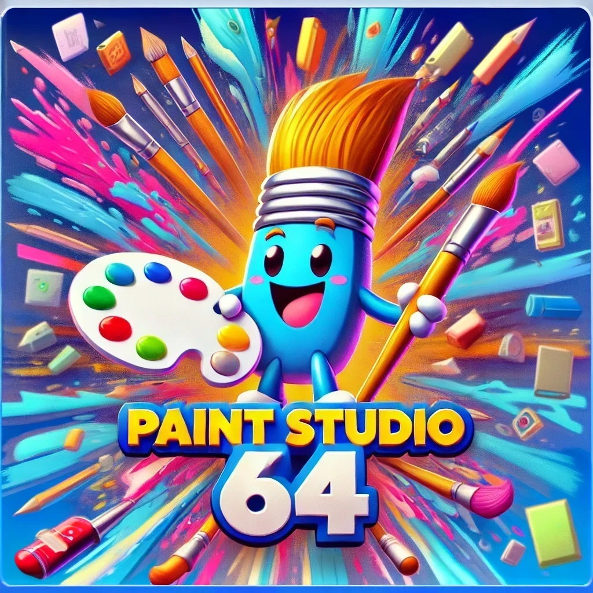

# Paint Studio 64

An advanced (yet retro-inspired) paint and drawing application targeting the Nintendo 64 platform.  
This toolset demonstrates how far we can push the N64 hardware for creative purposes.

---

## Overview

**Paint Studio 64** (PS64) is structured as a series of `.c`, `.h`, and `.S` files covering everything from memory-optimized routines (like `fast_memcpy.S`) to a full layer/brush system, advanced filters, voice commands, and more. The application is designed to run on real N64 hardware or through emulators (with a suitable N64 development toolchain).

**Key Goals**:
- Provide a multi-layer paint environment (up to 6 layers if an Expansion Pak is present).
- Allow dynamic resizing of the canvas, capping at **640×480** on 4 MB systems and up to **1024×1024** when 8 MB is detected.
- Demonstrate advanced features like blur, sharpen, selection tools, custom brushes, undo/redo stacks, and multiplayer co-op.

---

## Core Features

1. **Canvas & Layers**  
   - Multiple layers with visibility/opacity controls, reordering, and dynamic resizing/rotation.  
   - Canvas detection of Expansion Pak, enabling higher resolutions only if memory allows.

2. **Brush System**  
   - Built-in brushes plus a customizable brush editor for shape/texture-based painting.  
   - Pressure-based brush strokes (for simulating partial transparency).

3. **Advanced Filters**  
   - Blur, sharpen, grayscale, sepia, and a simple “bucket fill” approach.  
   - Non-destructive adjustment layers for brightness/contrast.

4. **Selection Tools**  
   - Rectangular or freeform (mask-based) selection.  
   - Copy, paste, move, and invert selections.

5. **Undo/Redo**  
   - Stores up to 10 snapshots with descriptions and timestamps.  
   - Separate stack used for redo operations.

6. **Audio & Voice**  
   - Basic SFX for painting actions (e.g., brush/goma).  
   - Stubs for local voice recognition and external VR libraries (e.g., pocketsphinx).

7. **Multiplayer & Competitions**  
   - Up to 4 local players can draw simultaneously.  
   - Timed “competition” modes for added fun.

8. **Export System**  
   - Save final output in raw RGB565 or compressed RLE.  
   - Basic metadata embedding (layer count, notes, etc.).

---

## Repository Structure

All source code files currently reside at the top level (e.g., `transferpak_base.c`, `tools_advanced.h`, etc.). For larger-scale development, you can optionally move them into more specialized folders like `src/`, `include/`, etc.  

Key modules of note:

- **`fast_memcpy.S`**: MIPS assembly for optimized memory transfers.  
- **`layer_system.*`**: Manages multi-layer painting.  
- **`undo_system.*`**: Undo/redo snapshot system.  
- **`selection_system.*`**: Rectangular and freeform selection.  
- **`advanced_filters.*`**: Core image filters (blur, sharpen, grayscale, etc.).  
- **`multiplayer.*`, `multiplayer_competitions.*`**: 2–4 player local co-op features.  
- **`main.c`**: Entry point tying everything together.

---

## Building & Usage

1. **N64 Toolchain**  
   - You’ll need a Nintendo 64 dev kit or modern toolchain (like [libdragon](https://github.com/DragonMinded/libdragon)) to compile and produce a `.n64` or `.z64` ROM.

2. **Recommended Flags**  
   - MIPS3 or MIPS2 code generation, `-O2` or `-O3` for speed.  
   - Link in the `.S` file for `fast_memcpy`.

3. **Running on Emulator**  
   - Use an emulator that supports the Transfer Pak and any custom hardware calls if you want to test those features fully.

4. **Hardware**  
   - On real N64 with **4 MB** RAM, the canvas is capped at 640×480.  
   - With the **Expansion Pak** (8 MB), you can push up to 1024×1024 and more layers.

---

## Limitations

- **No** PNG/JPEG export: Images are stored in raw RGB565 or RLE.  
- **No** AI Tools: We excluded advanced AI-based painting or detection.  
- Basic voice recognition is mostly a stub or mock; real integration requires specialized libraries and might exceed the N64’s typical memory constraints.

---

## Contributing

We welcome suggestions or pull requests to refine the code:

1. **Fork** the repo and create a feature branch.  
2. Implement your improvements (memory optimizations, better filters, etc.).  
3. Test thoroughly on an emulator or (if available) real hardware.  
4. Submit a pull request describing your changes.

Feel free to open **issues** if you spot bugs or have feature requests. 

**Enjoy** exploring how far you can push painting software on classic hardware!
